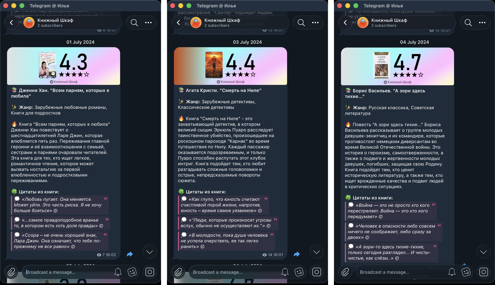

# Bookcase — «Книжный Шкаф»

Полностью автоматизированный конвейер, который сам ведёт книжный контент-проект: находит книгу, собирает по ней отзывы и цитаты, просит нейросеть написать рецензию, озвучивает её, монтирует вертикальный ролик и публикует всё это в YouTube Shorts и Telegram-канал — без участия человека.

Пет-проект 2023–2024 годов. Архивная версия «как есть».

---

## Демо

### Готовый ролик для YouTube Shorts

Иэн Макьюэн, «Искупление» — полностью сгенерированный конвейером выпуск, опубликованный на канале [«Книжный Шкаф»](https://www.youtube.com/@bookcaser):

https://youtu.be/ZAYHyWEg2fE

1:03, 720×1280. Тот же ролик лежит и в репозитории: [media/youtube-short-atonement.mp4](media/youtube-short-atonement.mp4).

### Посты в Telegram-канале

Обложка с рейтингом, жанры, рецензия и подборка цитат собираются автоматически по каждой книге:



---

## Зачем это делалось

Идея была проверить, можно ли закрыть весь цикл работы небольшого книжного медиа кодом — от выбора книги до отложенной публикации по расписанию.

Задачи, которые проект решает:

- **Убрать ручной труд.** Один запуск `main.py` готовит и ставит в очередь публикации сразу на несколько дней вперёд.
- **Писать осмысленные рецензии, а не пересказ аннотации.** Модель получает на вход реальные читательские отзывы с LiveLib вместе с описанием книги, поэтому текст отражает то, что о книге на самом деле думают.
- **Собирать видео программно.** Монтаж, маски, скругления, титры, озвучка и подложка — всё описано кодом, без видеоредактора.
- **Публиковать в двух форматах сразу.** Один и тот же материал превращается и в вертикальный ролик, и в пост с цитатами.
- **Не повторяться.** Уже опубликованные и «сломавшиеся» книги записываются в отдельные таблицы и больше не выбираются.

---

## Возможности

### Сбор данных о книгах

- Парсинг каталога LiveLib по жанрам с фильтром по количеству отзывов и цитат (`find_books.py`, `livelib.py`).
- Альтернативный источник — Литрес (`litres.py`, `parse_books.py`).
- По каждой книге вытягиваются обложка, рейтинг, жанры, описание, отзывы с оценками и цитаты.
- Итоговый каталог складывается в CSV (`books_data.csv`), который потом читает `main.py`.

### Генерация рецензии

- `chat_gpt.py` собирает промпт из описания книги и отзывов читателей.
- Отзывы добавляются по одному с подсчётом токенов через `tiktoken`, пока промпт не упрётся в контекстное окно модели, — так в запрос помещается максимум полезного.
- Модель играет роль книжного критика и продавца-консультанта: коротко рассказывает, о чём книга и кому она подойдёт.

### Синтез речи

- `voiceover.py` озвучивает каждую фразу рецензии отдельным файлом (OpenAI TTS, голос `nova`).
- Длительность каждого аудиофрагмента задаёт длительность соответствующей видеосцены — картинка сама подстраивается под озвучку.

### Автоматический видеомонтаж

`makevideo.py` собирает вертикальный ролик 1080×1920 из сцен:

| Сцена | Что показывается |
|---|---|
| Приветствие | анимированный стикер `hello.gif` |
| Обложка | обложка книги с анимированной маской проявления и скруглёнными углами |
| Рецензия | текст по фразам, каждая — отдельная сцена под свою озвучку |
| Вопрос зрителю | «А вы читали эту книгу?» с думающим смайлом |
| Промо Telegram | демо-ролик канала |

Поверх — анимированная подложка, нижняя плашка (lower third), фоновая музыка приглушается и подмешивается к озвучке через `ffmpeg`.

### Превью для Telegram

`preview.py` рисует карточку поста: обложка книги, крупный рейтинг, звёзды, градиентный фон и подпись канала.

### Публикация

- **YouTube** — `youtube_api.py` через YouTube Data API v3 заливает ролик с заголовком, описанием, ключевыми словами и **отложенной датой публикации**.
- **Telegram** — `telegram_bot.py` через Telethon отправляет в канал пост с превью, рецензией, жанрами и подборкой цитат, тоже **по расписанию**. Цитаты добавляются, пока пост не упрётся в лимит Telegram в 1024 символа.

### Устойчивость к сбоям

- До 5 попыток на книгу; если все неудачны — книга уходит в `error_books.csv` вместе с текстом ошибки, и конвейер берёт следующую.
- Опубликованные книги фиксируются в `uploaded_books.csv` и исключаются из выборки.
- Дата последней публикации хранится в `last.publishtime`, следующий запуск продолжает с неё.

---

## Как это работает

```
books_data.csv ──> выбор ещё не опубликованной книги
                        │
                        ▼
        LiveLib: обложка, рейтинг, жанры, описание, отзывы, цитаты
                        │
                        ▼
              GPT: рецензия «о чём и кому подойдёт»
                        │
            ┌───────────┴───────────┐
            ▼                       ▼
      TTS: озвучка            preview.py: карточка
            │                       │
            ▼                       ▼
   makevideo.py: монтаж      telegram_bot.py: пост
     (moviepy + ffmpeg)        в канал по расписанию
            │
            ▼
   youtube_api.py: заливка Shorts с отложенной публикацией
            │
            ▼
   запись в uploaded_books.csv
```

---

## Структура проекта

```
main.py              — оркестратор: полный цикл публикации
livelib.py           — парсер LiveLib (книги, отзывы, цитаты, жанры, обложки)
litres.py            — парсер Литрес
find_books.py        — обход каталога по жанрам, сбор books.csv
parse_books.py       — сбор списка книг с Литрес
chat_gpt.py          — сборка промпта и запрос рецензии
voiceover.py         — синтез речи
makevideo.py         — видеомонтаж
preview.py           — карточка-превью для Telegram
telegram_bot.py      — публикация в Telegram
youtube_api.py       — публикация на YouTube
data.py              — хэштеги, шаблон команды загрузки
analis.ipynb         — чистка и дедупликация каталога книг

Source/              — ассеты: шрифты, музыка, маски, анимации, подложки
media/               — демонстрационные материалы для README
```

Данные в репозиторий не входят: каталог книг, журналы публикаций и рабочая
директория рендера `temp/` создаются при запуске (см. «Запуск»).

---

## Стек

- **Python 3**
- **Парсинг:** `requests`, `BeautifulSoup`, `selenium`
- **Данные:** `pandas`
- **Нейросети:** OpenAI API (GPT-3.5 Turbo для текста, TTS-1 для озвучки), `tiktoken`
- **Видео и аудио:** `moviepy`, `Pillow`, `pydub`, `mutagen`, `ffmpeg`
- **Публикация:** `google-api-python-client` (YouTube Data API v3), `telethon`, `pytelegrambotapi`

---

## Запуск

Проект писался под Windows — пути к файлам в коде записаны с обратными слешами (`Source\\FinalVideos\\...`).

Нужен установленный `ffmpeg`, доступный из `PATH`.

### Конфигурация

Файлы с ключами намеренно исключены из репозитория. Чтобы запустить проект, создайте рядом с `main.py` файл `secret_data.py`:

```python
chatgpt_key = '...'   # ключ OpenAI (в проекте использовался прокси api.proxyapi.ru)
tgbot_token = '...'   # токен Telegram-бота
api_id      = 000000  # api_id приложения Telegram (my.telegram.org)
api_hash    = '...'   # api_hash приложения Telegram
youtube_api = '...'   # ключ YouTube Data API
```

Для загрузки на YouTube понадобится `client_secrets.json` из Google Cloud Console (OAuth-клиент типа «Desktop app») с включённым YouTube Data API v3. При первом запуске `youtube_api.py` откроет браузер для авторизации и сохранит токен рядом.

Telethon при первом запуске попросит войти в аккаунт Telegram и создаст файл сессии `anon.session`.

Парсеру LiveLib нужны куки авторизованной сессии: откройте `livelib.py` и `find_books.py` и подставьте свои значения вместо `<ВСТАВЬТЕ_СВОИ_COOKIE_LIVELIB>` в заголовке `Cookie` (скопировать можно из DevTools браузера).

### Данные

Каталог книг и журналы публикаций в репозиторий не входят — их нужно собрать самому. Рядом с `main.py` должны лежать:

- `books_data.csv` — каталог с колонками `Автор`, `Произведение`, `Ссылка на произведение`; собирается через `find_books.py`.
- `uploaded_books.csv` и `error_books.csv` — журналы уже опубликованных и «сломавшихся» книг, с теми же колонками (у `error_books.csv` добавляется `Ошибка`). Достаточно создать их с одной строкой заголовков.
- `last.publishtime` — дата, от которой отсчитываются публикации: `pickle`-файл с объектом `datetime`.

Ещё нужна пустая директория `temp/` — в неё складываются озвучка, обложки и промежуточные рендеры.

### Публикация

```bash
python main.py
```

По умолчанию готовит 6 публикаций подряд, отсчитывая даты от значения в `last.publishtime`.

---

## Состояние проекта

Проект законсервирован и выложен как есть, без доработок. Что стоит иметь в виду:

- Пути к ассетам захардкожены в Windows-формате и не заработают на macOS и Linux без правки.
- В `livelib.py` и `find_books.py` парсер ходит на LiveLib с захардкоженными HTTP-заголовками. Куки из них вычищены и заменены на плейсхолдер `<ВСТАВЬТЕ_СВОИ_COOKIE_LIVELIB>` — без своих значений парсер работать не будет.
- Вёрстка страниц LiveLib и Литрес с 2024 года менялась, селекторы парсеров могут не совпадать с текущей.
- Ассет `Source/FinalVideos/think.gif` пересжат под лимит GitHub на размер файла: 1920×1080 → 1334×750. В коде он всё равно масштабируется до высоты 750, так что на итоговое видео это не влияет.

---

*Этот README и описание проекта написаны с помощью Claude (Anthropic).*
